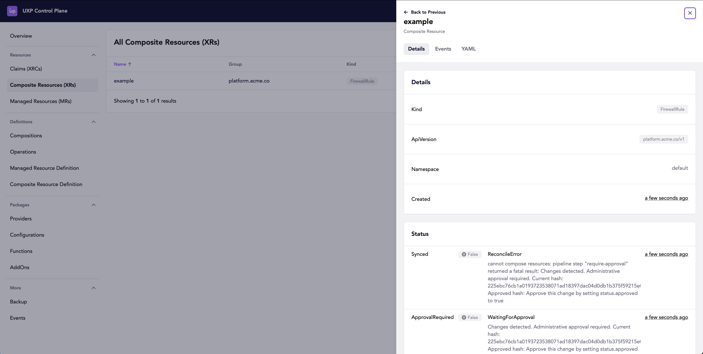
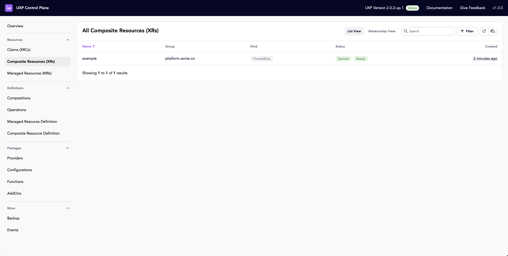

# approval

This project demonstrates the use of `function-approve` in a sample composition

## Installation

Start a local Upbound Crossplane control plane from the project root directory

```bash
up project run --local
```

## Examples

Once the control plane is running, apply the example `FirewallRule`:

```bash
kubectl apply -f examples/firewallrule/example.yaml
```

You can view the Composite Resource, with its pending approval required in the Upbound Crossplane Web UI

```bash
up uxp web-ui open
```



Approve the change, and watch the resource move from unready to ready

```bash
kubectl patch firewallrule example --type=merge --subresource=status -p '{"status":{"approved":true}}' 
```



## Testing

```bash
up test run tests/*
```
